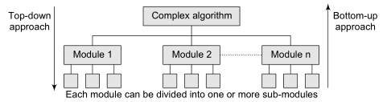

# Unit I : Introduction to Data Structure and Algorithm

Introduction:  structure and problem solving,  algorithmic notation,  Data Structure,  Algorithms and sub algorithms, introduction to algorithm analysis for time and space  

## Introduction

Computer Science is the study of data, its representation and transformation by Computer. For every data object, we consider the class of operations to be performed and then the way to represent the object so that these operations may be efficiently carried out. We require two techniques for this: 

- Devise alternative forms of data representation 
- Analyze the algorithm which operates on the structure. 

### Variable
### Data
### Program

#### Programming Language

Interactions involving humans are most effectively carried out through the medium of language. Language permits the expression of thoughts and ideas, and without it, communication as we know it would be very difficult indeed.  In computer programming, a programming language serves as a means of  communication between the person with a problem and the computer used to  help solve it. An effective programming language enhances both the development  and the expression of computer programs. It must bridge the gap between the often unstructured nature of human thought and the precision required for computer execution. 

A hierarchy of programming languages based on increasing machine independence includes the following: 

1. Machine-level languages 

2. Assembly languages 

3. Higher-level or user-oriented languages 

4. Problem-oriented languages 


1. A **machine-level language** is the lowest form of computer language. Each  instruction in a program is represented by a numeric code, and numerical addresses are used throughout the program to refer to memory locations in the computer's memory. All bookkeeping aspects of the program are the sole responsibility of the machine-language programmer. Finally, all diagnostics and programming aids must be supplied by the programmer. Also included as machine-level programs are programs written in microcode (i.e., microprograms). 

   Microcode allows for the expression of some of the more powerful machine-level instructions in terms of a set of basic machine instructions. 

5. **Assembly language** is essentially a symbolic version of a machine-level  language. Each operation code is given a symbolic code such as ADD for addition and MUL for multiplication. Moreover, memory locations are given symbolic names such as PAY and RATE. Some assembly languages contain macroinstructions which are at a higher level than assembly-languages instructions. Assembly- language systems offer certain diagnostic and debugging assistance that is normally not available at the machine level. 

6. A **high-level language** such as FORTRAN, PASCAL, or PL/I offers most of the features of an assembly language. While some facilities for accessing system- level features may not be provided, a high-level language offers a more enriched set of language features such as structured control constructs, nested statements, blocks, and procedures. 

7. A **problem-oriented language** provides for the expression of problems in a specific application or problem area. Examples of such languages are SEQUEL for database retrieval applications and COGO for civil engineering applications. 

**Advantages of high-level languages over low-level languages such as machine and assembly languages include the following:** 

1. High-level languages are easier to learn than their lower-level counterparts. The learning of many high-level languages requires little or no computer hardware background because such languages are relatively  machine-independent. Furthermore, these languages are closer to their problem areas than lower-level languages. 

2. The programmer does not have to be concerned with clerical tasks involving numerical or symbolic references to instructions, memory locations,  constants, etc. Such tasks are handled by a system which translates the high-level language program into machine language. 

3. A programmer is not required to know how to convert data from external forms to various internal forms within the memory of a computer. The ability of a programmer to convert, say, numeric data into internal forms such as floating-point numbers and packed-decimal numbers should be irrelevant. 

4. Most high-level languages offer a programmer a variety of control structures which are not available in low-level languages. High-level languages offer several of the following language constructs: 

   1. Conditional statements (such as IF-THEN-ELSE and CASE statements) 

   2. Looping statements (for both counted and conditional loops) 

   3. Nested statements 

   4. Block structures 

      `These control structures improve programming style and facilitate certain programming approaches such as structured programming. Resulting  programs are easier to read, understand, and alter. This results in reduced  programming costs because programs are less complicated. `

   5. Programs written in a high-level language are usually more easily debugged than their machine- or assembly-language equivalents. High-level languages offer constructs that eliminate or reduce certain kinds of programming errors that occur in low-level languages. For example, the declaration of variables in  a program adds a certain degree of redundancy which is useful in detecting errors in the improper use of variables. Languages often enforce a disciplined use of pointers. Moreover, a structured program is much more easily   debugged than its unstructured counterpart. 

   6. Since most high-level languages offer more powerful control and data-structuring capabilities than low-level languages, the former class of  languages facilitates the expression of a solution to a particular problem. 

   7. Because of the availability of certain language features such as procedures, high-level languages permit a modular and hierarchical description of  programming tasks. These tasks can then be assigned to a team of programmers, thus facilitating a division of labor with a minimum of disruption and effort. Such an approach permits better documentation of a problem. Also,  increased compatibility among programs and programmers can be realized. 

   8. Finally, high-level languages are relatively machine-independent.  Consequently, certain programs such as FORTRAN and COBOL programs are portable. These programs can be executed on different computers with little, if any, change even though these computers have different internal  architectures and machine-language instruction sets. Program portability reduces costs and, in general, protects an installation against computer obsolescence. Often when a computer is replaced, all associated assembly- and machine-language programs become obsolete. 

### structure and problem solving
## Data Structure
### Introduction to Data Structure
> The way information is organized in the memory of a computer is called a data structure

>A data structure is a way of organizing data that considers not only the items stored, but also their relationship to each other. Advance knowledge about the relationship between data items allows designing of efficient algorithms for the manipulation of data.

>- Many algorithms require that we use a proper representation of data to achieve efficiency.
>- This representation and the operations that are allowed for it are called data structures.
>- Each data structure allows insertion, access, deletion etc.

**Why do we need data structures?**

- Data structures allow us to achieve an important goal: component reuse
- Once each data structure has been implemented once, it can be used over and over again in various applications.
- Common data structures are Stacks, Queues, Lists, Trees, Graphs, Tables etc.

### Types of Data Structure/Classification of Data Structure

`Based on how the data items or operated it will classified into`

1. **Primitive Data Structure** : is one the data items are operated closest to the machine level instruction. Eg : int, char and double.

2. **Non-Primitive Data Structure** : is one that data items are not operated closest to machine level instruction.

  1. **Linear Data Structure** : In which the data items are stored in sequence order. Eg: Arrays, Lists, Stacks and Queues.

    **Linear Data Structures**
    
    1. List
    
      1. Array
        1. One Dimensional
        2. Multi-Dimensional
        3. Dynamic Array
        4. Matrix
          1. Sparse Matrix
      2. Linked List
        1. Single Linked List
        2. Double Linked List
        3. Circular Linked List
      3. Ordered List
        1. Stack
        2. Queue
          1. Circular Queue
          2. Priority Queue
        3. Deque
    
      **Dictionary (Associative Array)**
    
      1. Hash Table
    
    **Operations performed on any linear structure:**
    
    1. Traversal – Processing each element in the list
    2. Search – Finding the location of the element with a given value.
    3. Insertion – Adding a new element to the list.
    4. Deletion – Removing an element from the list.
    5. Sorting – Arranging the elements in some type of order.
    6. Merging – Combining two lists into a single list.

  2. **Non Linear Data Structure** : In which the order of data items is not presence. Eg : Trees, Graphs.

     **Non‐Linear Data Structures**

     1. Graph
       1. Adjacency List
       2. Adjacency Matrix
       3. Spanning Tree
     2. Tree
       1. M‐Way Tree
       2. B‐Tree
             1. 2‐3‐4 Tree
                 2. B+ Tree
       3. Binary Tree
             1. Binary Search Tree
                 2. Self‐Balancing Binary Search Tree
                       1. AVL Tree
                       2. Red‐Black Tree
                       3. Splay Tree
                         3. Heap
                       1. Min Heap
                       2. Max Heap
                       3. Binary Heap
                         4. Parse Tree

## Algorithms
### Introduction to Algorithm
### Sub Algorithms

A sub algorithm is  an independent component of an algorithm often broken down into smaller chunks and for this reason is defined separately from the main algorithm. The purpose of a sub algorithm is to perform some computation when required, under control of the main  algorithm. This computation may be performed on zero or more parameters passed by the calling routine. So that they are easy to read, reuse in another algorithm

When the problem is very complex, it is divided into several independent sub-problems. Each sub-problem is called sub-algorithm and can be developed independently. These sub-problems can be combined together to  form the solution for the entire problem. Thus by using sub-algorithms the complex problems can be solved easily. 

> A sub-algorithm is a block of instructions that is executed  when it is called from some other point of the algorithm.

Sub-algorithms are of two type:

- Sub-algorithms that do not return a value
- Sub-algorithms that return a value

The sub-algorithm is called function in C++.

1. **Definition of a sub-algorithm that does not return a value**

   1. **Sub-algorithm without arguments:**

   ```
   SUBALGORITHM  subalgorithm-name ( )
     Statements
   END subalgorithm-name
   ```
   where, ( ) is the empty list.

   2. **Sub-algorithm with arguments:**

   ```
   SUBALGORITHM  subalgorithm-name (parameter-list)    
       Statements
   END subalgorithm-name
   ```
   where, Parameter-list is a list that contains one or more parameters that are passed to the sub-algorithm.

Note: The call to a sub-algorithm that does not return a value is given in the CALL statement which has the following syntax:

> subalgorithm-name (Actual parameters)
>
> e.g.        sum(4,7) or sum(x,y)
>

2. **Definition of a sub-algorithm that returns a value:**

   1. **Sub-algorithm without arguments:**

      ```
      ftype  SUBALGORITHM  subalgorithm-name ( )
              Statements
         END subalgorithm-name
      ```
      Notes:

      - ftype: is any data type that the result of a subalgortihm can have. If the subalgorithm does not return any result, then no type is specified.
      - ( ) empty list.
      - If the subalgorithm has a type, then the Statements in the body of the subalgorithm should have return statement, usually it is the last statement.

   2. **Sub-algorithm without arguments:**
       ```
       ftype  SUBALGORITHM  subalgorithm-name (parameter-list)
          Statements
       END subalgorithm-name
       ```

       Notes:

       - ftype: is any data type that the result of a Subalgorithm can have. If the Subalgorithm does not return any result, then no type is specified.
       - parameter-list: includes one or more arguments.
       - If the Subalgorithm has a type, then the Statements in the body of the Subalgorithm should have return statement, usually it is the last statement.

### DIFFERENT APPROACHES TO DESIGNING AN ALGORITHM

Algorithms are used to manipulate the data contained in data structures. When working with data structures, algorithms are used to perform operations on the stored data. A complex algorithm is often divided into smaller units called modules. This process of dividing an algorithm into modules is called modularization. The key advantages of modularization are as follows:

- complex algorithm simpler to design and implement.

- Each module can be designed independently. While designing one module, the details of other modules can be ignored, thereby enhancing clarity in design which in turn simplifies implementation, debugging, testing, documenting, and maintenance of the overall algorithm. 

  There are two main approaches to design an algorithm—top-down approach and bottom-up approach, as shown in Fig. 



#### Top-down approach

A top-down design approach starts by dividing the complex algorithm into one or more modules. These modules can further be decomposed into one or more sub-modules, and this process of decomposition is iterated until the desired level of module complexity is achieved. Top-down design method is a form of stepwise refinement where we begin with the topmost module and incrementally add modules that it calls. Therefore, in a top-down approach, we start from an abstract design and then at each step, this design is refined into more concrete levels until a level is reached that requires no further refinement. 

#### Bottom-up approach 

A bottom-up approach is just the reverse of top-down approach. In the bottom-up design, we start with designing the most basic or concrete modules and then proceed towards designing higher level modules. The higher level modules are implemented by using the operations performed by lower level modules. Thus, in this approach sub-modules are grouped together to form a higher level module. All the higher level modules are clubbed together to form even higher level modules. This process is repeated until the design of the complete algorithm is obtained.

#### STRUCTURED PROGRAMMING

It is a programming style; and this style of programming is known by several names:
Procedural decomposition, Structured programming, etc. Structured programming is not programming with structures but by using following types of code structures to write programs:

1. Sequence of sequentially executed statements
2. Conditional execution of statements (i.e., “if” statements)
3. Looping or iteration (i.e., “for, do...while, and while” statements)
4. Structured subroutine calls (i.e., functions)

In particular, the following language usage is forbidden:

- “GoTo” statements
- “Break” or “continue” out of the middle of loops
- Multiple exit points to a function/ procedure/ subroutine (i.e., multiple “return” statements)
- Multiple entry points to a function/ procedure/ subroutine/ method

In this style of programming there is a great risk that implementation details of   many data structures have to be shared between functions, and thus globally exposed.   This in turn tempts other functions to use these implementation details; thereby creating   unwanted dependencies between different parts of the program.   The main disadvantage is that all decisions made from the start of the project depends directly or indirectly on the high-level specification of the application. It is a well-   known fact that this specification tends to change over a time. When that happens, there   is a great risk that large parts of the application need to be rewritten.

#### Top-down vs bottom-up approach 
Whether the top-down strategy should be followed or a bottom-up is a question that can be answered depending on the application at hand. While top-down approach follows a stepwise refinement by decomposing the algorithm into manageable modules, the bottom-up approach on the other hand defines a module and then groups together several modules to form a new higher level module.
Top-down approach is highly appreciated for ease in documenting the modules, generation of test cases, implementation of code, and debugging. However, it is also criticized because the sub-modules are analysed in isolation without concentrating on their communication with other modules or on reusability of components and little attention is paid to data, thereby ignoring the concept of information hiding.
Although the bottom-up approach allows information hiding as it first identifies what has to be encapsulated within a module and then provides an abstract interface to define the module’s boundaries as seen from the clients. But all this is difficult to be done in a strict bottom-up strategy. Some top-down activities need to be performed for this.
All in all, design of complex algorithms must not be constrained to proceed according to a fixed pattern but should be a blend of top-down and bottom-up approaches.

### Algorithmic Notation
#### Big Oh
#### Big Omega
#### Big Theta
## Algorithm Analysis
### introduction to algorithm analysis
After designing an algorithm, it has to be checked and its correctness needs to be predicted; this is done by analyzing the algorithm. The algorithm can be analyzed by tracing all step-by-step instructions, reading the algorithm for logical correctness, and testing it on some data using mathematical techniques to prove it correct. Another type of analysis is to analyze the simplicity of the algorithm. That is, design the algorithm in a simple way so that it becomes easier to be implemented. However, the simplest and most straightforward way of solving a problem may not be sometimes the best one. Moreover there may be more than one algorithm to solve a problem. The choice of a particular algorithm depends on following performance analysis and measurements : 

1. Space complexity
2. Time complexity

### Complexity
#### Time Complexity
The time complexity of an algorithm or a program is the amount of time it needs to run to completion. The exact time will depend on the implementation of the algorithm, programming language, optimizing the capabilities of the compiler used, the CPU speed, other hardware characteristics/ specifications and so on. To measure the time complexity accurately, we have to count all sorts of operations performed in an algorithm. If we know the time for each one of the primitive operations performed in a given computer, we can easily compute the time taken by an algorithm to complete its execution. This time will vary from machine to machine. By analyzing an algorithm, it is hard to come out with an exact time required. To find out exact time complexity, we need to know the exact instruc- tions executed by the hardware and the time required for the instruction. The time com- plexity also depends on the amount of data inputted to an algorithm. But we can calculate the order of magnitude for the time required. That is, our intention is to estimate the execution time of an algorithm irrespective of the computer machine on which it will be used. Here, the more sophisticated method is to identify the key operations and count such operations performed till the program com- pletes its execution. A key operation in our algorithm is an operation that takes maximum time among all possible operations in the algorithm. Such an abstract, theoretical ap- proach is not only useful for discussing and comparing algorithms, but also it is useful to improve solutions to practical problems. The time complexity can now be expressed as function of number of key operations performed. Before we go ahead with our discussions, it is important to understand the rate growth analysis of an algorithm, as shown in Fig

#### Space complexity

Analysis of space complexity of an algorithm or program is the amount of memory it needs to run to completion. Some of the reasons for studying space complexity are: 

1. If the program is to run on multi user system, it may be required to specify the
    amount of memory to be allocated to the program.
2. We may be interested to know in advance that whether sufficient memory is
    available to run the program.
3. There may be several possible solutions with different space requirements.
4. Can be used to estimate the size of the largest problem that a program can solve.

The space needed by a program consists of following components.

- Instruction space : Space needed to store the executable version of the program and it is fixed.

- Data space : Space needed to store all constants, variable values and has further two components :

  - Space needed by constants and simple variables. This space is fixed.
  - Space needed by fixed sized structural variables, such as arrays and structures.
  - Dynamically allocated space. This space usually varies.

- Environment stack space: This space is needed to store the information to resume the suspended (partially completed) functions. Each time a function is invoked the following data is saved on the environment stack :

  - Return address : i.e., from where it has to resume after completion of the called function.
  - Values of all lead variables and the values of formal parameters in the function being invoked .

  The amount of space needed by recursive function is called the recursion stack space. For each recursive function, this space depends on the space needed by the local variables and the formal parameter. In addition, this space depends on the maximum depth of the recursion i.e., maximum number of nested recursive calls. 

### Goals And Design Philosophies of Programming Language 

When a programming language is designed, particular attention must be given to the goals of the language. A number of important goals, such as human communication, the prevention and detection of errors, usability, program effectiveness, compatibility, efficiency, machine independence, and simplicity, are described in turn. This section is also concerned with design philosophies. Philosophies such as uniformity, orthogonality, generality, language modularity, minimality, and level of abstraction are discussed. 

1. **Human Communication** 

   While it is important to communicate efficiently with the computer, detect errors well, and so on, the most basic goal of a programming language is communication between human beings. If a program cannot be understood by humans, it is difficult to verify and it cannot be maintained or modified. Even if the program is still clear to its author, this is a strictly temporary condition. It has been suggested by Kernighan and Plauger (1976) that readability is the best single index of good programming. Certainly, one of the crucial factors in achieving readable programs is an understandable programming language. It is important to realize that the problems of human communication cannot be left entirely to comments or external documentation. Programmers dislike writing excessive comments and tend to avoid them. External documentation is all too often out-of-date and incomplete. Also, this can sometimes apply to internal documentation. A good and very reliable form of documentation is the program itself—if it is readable. Programming languages must be designed with constant attention to clarity and understandability. It is vital to distinguish between readability and writability. It is important to be able to write programs easily. It is necessary to be able to read programs easily. The readability of programs is far more important in the long run than their writability (Hoare, 1973). This is of particular significance because many "powerful" and "convenient" features tend to produce monumentally obscure programs (e.g., APL "one-liners"). The most basic implication of the readability problem for the design of programming languages is that the syntax must reflect the semantics. If the syntax of the programming language does not accurately and completely reflect the manipulations being carried out, there is little hope for understanding the program. Making the syntax match the semantics implies several things. The syntax must clearly state what is happening in sufficient detail to be  understandable but not in such unnecessary detail as to be overwhelming. Care should be taken to ensure that a construct performing a particular operation does not read as if it were doing something similar but not quite the same. Furthermore, it is most undesirable for significant actions to be undertaken without any indication in the syntax whatsoever. This rule may seem obvious, but a considerable number of languages violate it (notably PL/I with its conversions and ON-units, and ALGOL 68 with its coercions). A most unfortunate choice of terminology in the field of computer science is the term syntactic sugar because it implies that making language constructs understandable is an unnecessary frill. It is vital that the syntax of a programming language should reflect human thought patterns, rather than the more "elegant" but much more obscure patterns of, for example, the lambda calculus (Church, 1941) (or, still worse, the peculiarities of a particular computer's instruction set). A final facet that must be mentioned with regard to human communication through programming languages is that programmers are not computers. Just because a compiler can understand a given construct there is no guarantee that a programmer can. The limitations of the human mind make it quite easy for a complicated structure to become unmanageable, while the compiler has no problem. For example, a simple stack algorithm handles nested constructs for a compiler. Human beings, however, probably do not function in a stacklike manner, and deeply nested constructs can very easily become completely  incomprehensible. Humans are ill-equipped to cope with situations where the effect of a construct depends in a complex way on context (as can arise through the use of PL/I ON units). It is also quite possible for a construct to be ambiguous to a human while it is clear and obvious to a compiler (Weinberg, 1971). A good example of this is the simple arithmetic expression "a/b/c". In general, a parser will not consider this ambiguous, but how many human programmers would write it without using parentheses? Although it may be more time consuming for a compiler to disallow such a construct, the protection can be worth it. 

2. **Prevention and Detection of Errors **
   It is a recognized fact that programmers make errors. Although much current work in the field of software engineering is directed toward stopping errors at the source (the programmer), there is no foreseeable chance that errors will be eliminated entirely. It is therefore necessary to assist the programmer in the task of not only preventing but also detecting, identifying, and correcting errors. A good programming language can be a major factor in this. In fact, the efforts of Lampson et al. (1977) in the design of EUCLID, a PASCAL-based language intended for the expression of system programs which are to be verified, indicates that a programming language can significantly affect the ease with which a 

 

 

 

Unit-II 

Primitive and non-primitive data structure concept, representation and manipulation of strings, concept and terminology for non-primitive data structure, concept of arrays, stacks, and queues. Basic operations on arrays, stacks & queues. 

  

By Vinod: 

  

1. Data 
2. Data Type 
3. Data Structure 
4. Types of Data Structure 
   1. Linear and Non Linear 
   2. Primitive and Non-Primitive 
      1. Concepts 
      2. Terminology 
   3. Arrays and its Operations 
   4. Stack and its Operations 
   5. Queue and its Operations 
5. Strings 
   1. Representation 
   2. Manipulation 

  

- 

  

These are several terms involved above which we need to know carefully before we proceed. These include data structure, data type and data representation. 

  

Data Type: A data type is a classification of data, which can store a specific type of information. Data types are primarily used in computer programming, in which variables are created to store data. Each variable is assigned a data type that determines what type of data the variable may contain. 

A data type is a term which refers to the kinds of data that variables may hold. With every programming language there is a set of built-in data types. This means that the language allows variables to name data of that type and provides a set of operations which meaningfully manipulates these variables. 

Some data types are easy to provide because they are built-in into the computer’s machine language instruction set, such as integer, character etc. Other data types require considerably more efficient to implement. In some languages, these are features which allow one to construct combinations of the built-in types ( like structures in ‘C’). However, it is necessary to have such mechanism to create the new complex data types which are not provided by the programming language. The new type also must be meaningful for manipulations. Such meaningful data types are referred as abstract data type. 

  

Definition of Data Structure  

  

Primitive data type: The data structures, typically those data structure that are directly operated upon by machine level instructions i.e. the fundamental data types such as int, float, double in case of ‘c’ are known as primitive data structures.  

  

The term "data type" and "primitive data type" are often used interchangeably. Primitive data types are predefined types of data, which are supported by the programming language. For example, integer, character, and string are all primitive data types. Programmers can use these data types when creating variables in their programs. For example, a programmer may create a variable called "lastname" and define it as a string data type. The variable will then store data as a string of characters. 

Integer:  This is used to represent a number without decimal point. 

            Eg: 12, 90 


  

Float and Double: This is used to represent a number with decimal point. 

  Eg: 45.1, 67.3 

  

Character : This is used to represent single character 

  Eg: ‘C’, ‘a’ 

  

String: This is used to represent group of characters. 

Eg: "M.S.P.V.L Polytechnic College" 

  

Boolean: This is used represent logical values either true or false. 

  

  

Non-primitive data types are not defined by the programming language, but are instead created by the programmer. They are sometimes called "reference variables," or "object references," since they reference a memory location, which stores the data. In the Java programming language, non-primitive data types are simply called "objects" because they are created, rather than predefined. While an object may contain any type of data, the information referenced by the object may still be stored as a primitive data type. 

  

The data structures, which are not primitive are called non-primitive data structures. 

  

There are two types of non-primitive data structures.  

- Linear Data Structures:- A list, which shows the relationship of adjacency between elements, is said to be linear data structure. The most, simplest linear data structure is a 1-D array, but because of its deficiency, list is frequently used for different kinds of data. 
- Non-linear data structure:-A list, which doesn’t show the relationship of adjacency between elements, is said to be non-linear data structure. 

  

Type of Data Structures 

1. Data Structure 
   1. Primitive Or Built in Data Structures 
      1. Integer 
      2. Character 
      3. Double 
      4. Float 
      5. String 
   2. Non Primitive Or User Defined Data Structure 
      1. Linear 
         1. Array 
         2. Linked List 
            1. Singly 
            2. Doubly 
            3. Circular 
         3. Stack 
         4. Queue 
      2. Non-Linear 
         1. Graph 
         2. Tree 
         3. Hash 
         4. Forest 
      3. Files 

 