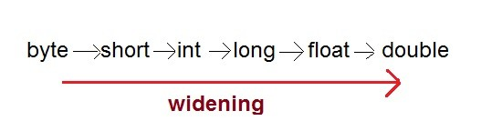

## Cast Conversion/Type casting/boxing-unboxing-autoboxing

Java language specification (SE7-JLS-5.0) uses the word ‘conversion’ as a superset for anything and everything related to transforming objects. The word ‘cast’ is used at places where the developer needs to explicitly tell the compiler that the instance value needs to be converted. Attaching the cast-operator (a type between parentheses), before an object is referred as cast.

## type-safety in Java

Type-safety is the mechanism provided in a programming language to ensure that there are no issues because of type mismatch between a variable and value attempted to store in it. In Java to ensure type-safety, during compile time the compiler will check for type information between variables using the static type information available. Then during runtime the values are checked for compatibility before storing in a variable.

As per Java language specification (SE7-JLS-5.0) conversions are broadly categorized as,

- Identity conversions
- Widening primitive conversions
- Narrowing primitive conversions
- Widening reference conversions
- Narrowing reference conversions
- Boxing conversions
- Unboxing conversions
- Unchecked conversions
- Capture conversions
- String conversions
- Value set conversions

## Identity Conversion

This is given for theoretical completeness. Assigning two instance of same type is identity conversion.

```java
	Integer i1;
	Integer i2 = new Integer(2);

	i1 = i2; //identity conversion
	// cast not required, but done compiler will not complain
	i1 = (Integer) i2;
```


## Primitive Conversions and Type Cast in Java

Assigning a value of one type to a variable of another type is known as Type Casting. When the data is converted from one data type to another data type, then it is called type casting. Type casting is nothing but changing the type of the data. Using type casting, only type of the data can be changed but not the data itself.

```java
Example :
int x = 10;
byte y = (byte)x;
```

In Java, type casting is classified into two types,

1. Widening Casting(Implicit)
2. Narrowing Casting(Explicitly done)




### Widening Primitive Conversion or Automatic type conversion

Automatic Type casting take place when, the two types are compatible the target type is larger than the source type. 

“A widening primitive conversion does not lose information about the overall magnitude of a numeric value.” There is no cast required and will never result in a runtime exception. Following are the possible widening conversions,

- byte to short, int, long, float, or double
- short to int, long, float, or double
- char to int, long, float, or double
- int to long, float, or double
- long to float or double
- float to double

Example: 

```java
public class Test
{
	public static void main(String[] args)
	{
		int i = 100;
		long l = i; //no explicit type casting required
		float f = l; //no explicit type casting required
		System.out.println("Int value "+i);
		System.out.println("Long value "+l);
		System.out.println("Float value "+f);
	}
}
Output :
Int value 100
Long value 100
Float value 100.0
  
/*------------------------------*/
class WideningConversion 
{
	public static void main(String[] args) 
    {
		int i = 123456789;
		float f = i;
	}
}
```

### Narrowing or Explicit type conversion

When you are assigning a larger type value to a variable of smaller type, then you need to perform explicit type casting. 

“A narrowing primitive conversion may lose information about the overall magnitude of a numeric value and may also lose precision and range.” Cast required between types. Overflow and underflow may happen but a runtime exception will never happen. Following are the possible narrowing conversions,

- short to byte or char
- char to byte or short
- int to byte, short, or char
- long to byte, short, char, or int
- float to byte, short, char, int, or long
- double to byte, short, char, int, long, or float
  Example :

```java
public class Test
{
	public static void main(String[] args)
	{
		double d = 100.04;
		long l = (long)d; //explicit type casting required
		int i = (int)l; //explicit type casting required
		System.out.println("Double value "+d);
		System.out.println("Long value "+l);
		System.out.println("Int value "+i);
	}
}
Output :
Double value 100.04
Long value 100
Int value 100
  
  
/*------------------------------------------------*/
public class NarrowingPrimitiveConversion 
{
	public static void main(String[] args) 
    {
		float f = Float.POSITIVE_INFINITY;
		long l = (long) f;
		int i = (int) f;
		System.out.println("long: " + l + " int: " + i);
		int j = 255;
		byte b = (byte) j;
		// size is too large and resulted in negative
		System.out.println(b);
	}
}
```

## Reference Conversions and Cast in Java

In this section let us see about categories, widening reference conversion and narrowing reference conversion. With respect to classes and objects, there are four categories to understand for casting.

1. Assigning a Float object to Integer directly has got nothing to do with casting and it will throw a compile error as incompatible type. Casting a Float into Integer is not proper and will get compile error as inconvertible types. Casting in Java is done within same hierarchy of types, that is between inherited types.
2. upcast – Casting a subtype object into a supertype and this is called upcast. In Java, we need not add an explicit cast and you can assign the object directly. Compiler will understand and cast the value to supertype. By doing this, we are lifting an object to a generic level. If we prefer, we can add an explicit cast and no issues.
3. downcast – Casting a supertype to a subtype is called downcast. This is the mostly done cast. By doing this we are telling the compiler that the value stored in the base object is of a super type. Then we are asking the runtime to assign the value. Because of downcast we get access to methods of the subtype on that object.
4. ClassCastExcpetion – We get ClassCastException in a downcast. In principle, we guarantee the compiler that the instance value of is subtype and ask it to cast. But during runtime, because of unforeseen circumstances, the value is not of expected subtype. In such cases, we get ClassCastException.


## Autoboxing and Unboxing in Java

Converting from a primitive type to its corresponding reference type is boxing conversion and vice versa is Unboxing conversion.

Examples are,

* From primitive boolean to type Boolean
* From primitive int to type Integer


```java
int i = 10;
Integer iObj = new Integer(100);
iObj = i;//boxing conversion
i = iObj;//unboxing conversion
```

**Autoboxing: **Converting a primitive value into an object of the corresponding [wrapper class](https://www.geeksforgeeks.org/wrapper-classes-java/) is called autoboxing. For example, converting int to Integer class. The Java compiler applies autoboxing when a primitive value is:

- Passed as a parameter to a method that **expects an object** of the corresponding wrapper class.
- Assigned to a variable of the corresponding **wrapper class**.

**Unboxing:** Converting an object of a wrapper type to its corresponding primitive value is called unboxing. For example conversion of [Integer](https://www.geeksforgeeks.org/wrapper-classes-java/) to int. The Java compiler applies unboxing when an object of a wrapper class is:

- Passed as a parameter to a method that **expects a value** of the corresponding primitive type.
- Assigned to a variable of the corresponding **primitive type**.

The following table lists the primitive types and their corresponding wrapper classes, which are used by the Java compiler for autoboxing and unboxing:


```java
// Java program to illustrate the concept
// of Autoboxing and Unboxing`
import java.io.*;
class GFG
{
	public static void` `main (String[] args)`

`    ``{`

`        ``// creating an Integer Object`

`        ``// with value 10.`

`        ``Integer i = ``new` `Integer(``10``);`

 

`        ``// unboxing the Object`

`        ``int` `i1 = i;`

 

`        ``System.out.println(``"Value of i: "` `+ i);`

`        ``System.out.println(``"Value of i1: "` `+ i1);`

 

`        ``//Autoboxing of char`

`        ``Character gfg = ``'a'``;`

 

`        ``// Auto-unboxing of Character`

`        ``char` `ch = gfg;`

`        ``System.out.println(``"Value of ch: "` `+ ch);`

`        ``System.out.println(``"Value of gfg: "` `+ gfg);`

 

`    ``}`

`}`

```
Value of i: 10
Value of i1: 10
Value of ch: a
Value of gfg: a
```java
//Another example to understand how compiler did autoboxing and unboxing in the example of Collections in java using generics.
/* Java program to illustrate autoboxing */
import java.io.*;
import java.util.*;
class GFG
{
	public static void main(String[] args)
	{
/* Here we are creating a listof elements of Integer type. adding the int primitives type values */
		List<Integer> list = new ArrayList<Integer>();
        for(int i = 0; i < 10; i++)
        	list.add(i);
     }
}
```

In above example we have created a list of elements of Integer type. We are adding int primitive type values instead of Integer Object and the code successfully compiled. It does not generate a compile time error as java compiler create Integer wrapper Object from primitive int i and adds it to the list.
See the following example for, How it converts…`/* Java program to illustrate autoboxing */``import` `java.io.*;``import` `java.util.*;` `class` `GFG``{``    ``public` `static` `void` `main (String[] args)``    ``{``        ``/* Here we are creating a list of elements``          ``of Integer type. Adding the int primitives``          ``type values by converting them into Integer``          ``wrapper Object*/``        ``List<Integer> list = ``new` `ArrayList<Integer>();``        ``for` `(``int` `i = ``0``; i < ``10``; i++)``            ``list.add(Integer.valueOf(i));` `    ``}``}`


Another example of auto and unboxing is to find sum of odd numbers in a list. Important point in the program is that the operators remainder (%) and unary plus (+=) operators do not apply to Integer objects. But still code compiles successfully because the unboxing of Integer Object to primitive int value is taking place by invoking intValue() method at runtime.

```java
//Java program to illustrate  find sum of odd numbers using autobxing and unboxing
import java.io.*;
import java.util.*;
class GFG
{
  	public static int sumOfOddNumber(List<Integer> list)    
    {
      int sum = 0;
      for (Integer i : list)
      {
        // unboxing of i automatically            
        if(i % 2 != 0)
          sum += i;
        /* unboxing of i is done automatically using intvalue implicitly           */
        if(i.intValue() % 2 != 0)
          sum += i.intValue();
      }
      return sum;
    }
  public static void main (String[] args)
  {
    /* Here we are creating a list of elements of Integer type and adding the int primitives type values to the list*/  
    List<Integer> list = new ArrayList<Integer>();
    for (int i = 0; i < 10; i++)
      list.add(i); 
    // getting sum of all odd no. in the list.
    int sumOdd = sumOfOddNumber(list);        
    System.out.println("Sum of odd numbers = " + sumOdd);    
  }
}
```

Output:

```
Sum of odd numbers = 25
```

**Advantages of Autoboxing / Unboxing:**

- Autoboxing and Unboxing lets developers write cleaner code, making it easier to read.
- The technique let us use primitive types and Wrapper class objects interchangeably and we do not need to perform any typecasting explicitly.


## String Conversion

String conversion applies only to the ‘+’ operator, when one operand is a String and another is a primitive type. In such a case, primitive type is converted to its corresponding reference type and then it is converted using the toString() method. No cast is required.

```java
int i = 10;
String str1 = "";
String str2 = str1 + i; //string conversion
```

Unchecked and Capture Conversion will be discussed in the next tutorial as part of the generics series.

##Questions

1. Difference between casting and autoboxing

2. **What are the types of casting.**

   There are two types of casting.

   * Primitive Casting : When the data is casted from one primitive type ( like int, float, double etc… ) to another primitive type, then it is called Primitive Casting.
   * Derived Casting : When the data is casted from one derived type to another derived type, then it is called derived casting.

3. **What is auto widening and explicit narrowing.?**

   The data is implicitly casted from small sized primitive type to big sized primitive type. This is called auto-widening. i.e The data is automatically casted from byte to short, short to int, int to long, long to float and float to double.

   You have to explicitly cast the data from big sized primitive type to small sized primitive type.  i.e you have to explicitly convert the data from double to float, float to long, long to int, int to short and short to byte This is called explicit narrowing.

4. **What is auto-up casting and explicit down casting.?**

   An object of sub class type can be automatically casted to super class type. This is called auto-up casting. An object of super class type should be explicitly casted to sub class type, It is called explicit down casting.

5. **Can an int primitive type of data implicitly casted to Double derived type.?**

   Yes, first int is auto-widened to double and then double is auto-boxed to Double.

6. **What is ClassCastException.?**

   ClassCastException is an exception which occurs at run time when an object of one type can not be casted to another type. 

7. **How do you avoid ClassCastException in your code.?**

   By using generics, you can avoid ClassCastException. (Click [here](http://javaconceptoftheday.com/why-we-need-generics-in-java/) to see how you can avoid ClassCastException Using generics.)

8. **What is boxing and unboxing.?**

   Wrapping of primitive content into corresponding wrapper class object is called boxing. Unwrapping the wrapper class object into corresponding primitive content is called un boxing.

9. **What is the difference between auto-widening, auto-upcasting and auto-boxing.?****

   Auto-widening occurs when small sized primitive type is casted to big sized primitive type. Auto-up casting occurs when sub class type is casted to super class type. Auto-boxing occurs when primitive type is casted to corresponding wrapper class.

10. **What are the priorities of auto-widening, auto-upcasting and auto-boxing.?**

