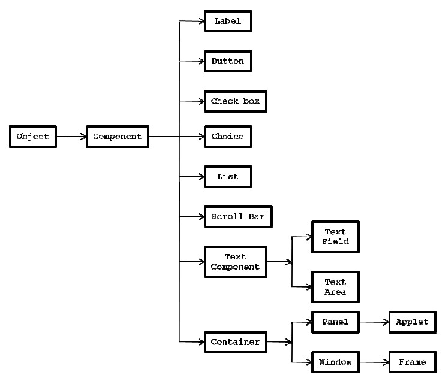

**AWT: Abstract WindowingToolkit**

In JAVA we can developto types of GUI (Graphic User Interface) applications. They are **standalone **GUI applications and **distributed **GUI applications. A **standalone GUI application** is one which runs in the context of local disk and our classmust extends a predefined class called java.lang.frame. A **distributed GUIapplication **is one which runs in the context of browser and our class mustextend java.applet.Applet class.

As a part of GUIapplications we use to create two types of components. They are **passive components **and **Active Components**

A **passive component **isone where there is no interaction from the user. For example label. An **active component **is one where there is an interaction from the user. For examplebutton, check box, scroll bar, etc.

The **active andpassive components **in JAVA are available in terms of classes. In order todeal with any GUI applications we must import a package called java.awt.*(contains various classes and interfaces for creating GUI components) andjava.awt.event.* (contains various classes and interfaces which will providefunctionality to GUI components).

 

**AWT Hierarchy Chart: **Whenever we develop anyGUI application we must have readily available window component and windowcomponent must contain frame component. Any GUI component which we want tocreate gives the corresponding class and Container class. 

AContainer is a class whose object allows us to add ‘n’ number of similar ordifferent GUI components to make a final application Except Object class andApplet class all the classes in the a to java.awt.* package.

 

**Label class**:

Label is a class whichis used for creating label as a part of windows application. The componentlabel comes under passive component. Labels always improve the functionalityand readability of active components. Creating a label is nothing but creatingan object of label components.

**Label class API:**

**Data members:**

```java
publicstatic final int LEFT (0)
publicstatic final int CENTER (1)
publicstatic final int RIGHT (2)
```
Theabove three statements are called alignment parameters or modifiers.

**Constructors:**
```java
Label()
Label(String)
Label(String label name, int alignment modifier)
```
**Instance methods:**
```java
public void setText (String);
public String getText ();
public void setAlignment (int);
public int getAlignment ();
```


**Write a JAVA programwhich creates Window and Frame?**

```java
import java.awt.*;
class myf extends Frame
{
Myf ()
{
setText (“AshaKrishna”);
setSize (100, 100);
setBackground (Colo
setForeground (Color, red);
setVisible (true);
}
}
class FDemo
{
Public static void main (String [] args)
{
Myf mo=new myf ();
}
}
```


**Event Delegation Model**

Whenever we want to develop any windows applications one must deal with event delegation model.Event delegation model contains four properties. They are: In order to process any active components, we must know either name or caption or label or reference of the component (object). Whenever we interact any active component,the corresponding active component will have one predefined Event class, whoseobject will be created and that object contains two details:

1. Name of the component.
2. Reference of the component.

The general form of every Event class is xxx event.

