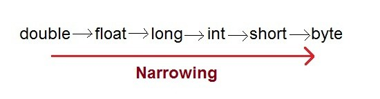

# Unit I

> An overview of Java: Object oriented programming, Two paradigms, abstraction, the, OOP principles, Java class  libraries, variables, arrays, Data types and casting, Operators, operator precedence, Control statements. 

## Introduction of Java

Java is one of the world's most important and widely used computer languages, and it has held this distinction for many years. Unlike some other computer languages whose influence has weared with passage of time, while java's has grown. Java is related to C++, which is a direct descendant of C. Much of the character of Java is inherited from these two languages. From C, Java derives its syntax. Many of Java’s object- oriented features were influenced by C++. In fact, several of Java’s defining characteristics come from—or are responses to—its predecessors. Till today it is the first and best choice for developing console/web-based applications.

#Evolution of Java, Creation of Java, History of Java

JAVA is a distributed technology developed by James Gosling, Patric Naugton, etc., at Sun Micro System has released lot of rules for JAVA and those rules are implemented by JavaSoft Inc, USA (which is the software division of Sun Micro System) in the year 1990. The original name of JAVA is OAK (which is a tree name). In the year 1995, OAK was revised and developed software called JAVA (which is a coffee seed name). 

James Ghosling, Patrick Naughton, Mike Sheridan initiated the Java language project in June 1991 at Sun Microsystems Inc. for use in one of his many set-top box projects. It took 18 months to develop the first working version. 

Thelanguage, initially called Oak after an oak tree that stood outside Gosling's office, also went by the name Green and ended up later being renamed as Java, from a list of random words.

Java was initially launched as Java 1.0 as core component of Sun Microsystems’ Java platform. Sun released the first public implementation as Java 1.0 in 1995. It promised Write Once, Run Anywhere (WORA), providing no-cost run-times on popular platforms. but soon after its initial release, Java 1.1 was launched. Java 1.1 redefined event handling, new library elements were added.

* In Java 1.2 Swing and Collection framework was added and suspend() , resume() and stop() methods were deprecated from Thread class.

No major changes were made into Java 1.3 but the next release that was Java 1.4 contained several important

changes.Keyword assert , chained exceptions and channel based I/O System was introduced.

 Java 1.5 was called J2SE 5, it added following major new features:

·        Generics

·        Annotations

·        Autoboxingand autounboxing

·        Enumerations

·        For-each Loop

·        Varargs

·        Static Import

·        Formatted I/O

·        Concurrency utilities

On 13 November 2006, Sun released much of Java as free and open source software under the terms of the GNU General Public License (GPL). 

On 8 May 2007, Sun finished the process, making all of Java's core code free andopen-source, aside from a small portion of code to which Sun did not hold the copyright. 

December 2008, the latest release of the Java Standard Edition is 6 (J2SE). With the advancement of Java and its widespread popularity, multiple configurations were built to suite various types of platforms. Ex: J2EE for

Enterprise Applications, J2ME for Mobile Applications.

 Nextmajor release was Java SE 7 which included many new changes like :

·        NowString can be used to control Swith statement.

·        MultiCatch Exception

·        try-with-resourcestatement

·        BinaryInteger Literals

·        Underscorein numeric literals.


JAVA released to the market in three categories 

* J2SE (JAVA 2 Standard Edition), 
* J2EE (JAVA 2 Enterprise Edition) and 
* J2ME (JAVA 2 Micro/Mobile Edition). 

1. **J2SE** is basically used for developing client side applications/programs. 
2. J2EE is used for developing server side applications/programs. 
3. J2ME is used for developing Mobile/PDA applications/programs

If you exchange the data between client and server programs (J2SE and J2EE), by default JAVA is having on internal support with a protocol called http.

J2ME is used for developing mobile applications and lower/system level applications. To develop J2ME applications we must use a protocol called WAP (Wireless Applications Protocol).

## Features of Java

The prime reason behind creation of Java was to bring portability and security feature into a computer language. Beside these two major features, there were many other features that played an important role in moulding out the final form of this outstanding language. 

Those features are :

1. Simple

2. Platform independent

3. Architectural neutral

4. Portable

5. Multi threading

6. Distributed

7. Networked

8. Robust

9. Dynamic

10. Secured

11. High performance

12. Interpreted

13. Object Oriented Programming Language

### Simple
JAVA is simple because of the following factors: 

1. JAVA is free from pointers hence we can achieve less development time and less execution time [whenever we write a JAVA program we write without pointers and internally it is converted into the equivalent pointer program]. 
2. Rich set of API (application protocol interface) is available to develop any complex application. 
3. The software JAVA contains a program called garbage collector which is always used to collect unreferenced (unused) memory location for improving performance of a JAVA program. [Garbage collector is the system JAVA program which runs in the background along with regular JAVA program to collect unreferenced memory locations by running at periodical interval of times for improving performance of JAVA applications. 
4. JAVA contains user friendly syntax’s for developing JAVA applications.

### Platform Independent

A program or technology is said to be platform independent if and only if which can run on all available operating systems. 

Unlike many other programming languages including C and C++, when Java is compiled, it is not compiled into platform specific machine, rather into platform independent byte code. This byte code is distributed over the web and interpreted by virtual Machine (JVM) on whichever platform it is being run. On compilation Java program is compiled into bytecode. This bytecode is platform independent and can be run on any machine, plus this bytecode format also provide security. Any machine with Java Runtime Environment can run Java Programs.

The languages like C, Cpp are treated as platform dependent languages since these languages are taking various amount of memory spaces on various operating systems [the operating system dos understands everything in the form of its native format called Mozart (MZ) whereas the operating system Unix understands everything in its negative format called embedded linking format (elf). When we write a C or Cpp program on dos operating and if we try to transfer that program to Unix operating system, we are unable to execute since the format of these operating systems are different and more over the C, Cpp software does not contain any special programs which converts one format of one operating system to another format of other operating system]. 

The language like JAVA will have a common data types and the common memory spaces on all operating systems and the JAVA software contains the special programs which converts the format of one operating system to another format of other operating system. Hence JAVA language is treated as platform independent language.

[JAVA language is also treated as server independent language since the server side program can run on any of the server which is available in the real world (web server or application server). JAVA can retrieve or store the data in any one of the data base product which is available in rest world irrespective of their vendors (developers) hence JAVA language is product independent language. In order to deal with server side program from the client side, we can use C language client program, Cpp client program, DOT NET client program, etc. hence JAVA language is a simple, platform independent, server independent, data base/product independent and language independent programming language].


### Architectural Neutral

Java compiler generates an architecture-neutral object file format, which makes the compiled code to be executable on many processors, with the presence of Java runtime system.

A language or technology is said to be processors in the real world. The language like JAVA can run on any of the processor irrespective of their vendor.


### Portable

A portable language is one which can run on all operating systems and on all processors irrespective their architectures and providers. The language like C, Cpp are treated as nonportable languages whereas the language Java is called portable language

### Multi Threading

With Java's multithreaded feature, it is possible to write programs that can do many tasks simultaneously. This design feature allows developers to construct smoothly running interactive applications. Benefit of multithreading is that it utilizes same memory and other resources to execute multiple threads at the same time, like While typing, grammatical errors are checked along.

1. A flow of control is known as thread.
2. A multi threaded program is one in which there exist multiple flow of controls ie. threads.
3. A program is said to be multi threaded program programs if and only of there exist n number of subprograms. For each and every sub flow of controls. All such flow of controls are executing concurrently. such flow of controls is know as threads. Such type of applications is known as multi threading applications.
4. The languages like C, Cpp are treated as threads as single threaded modeling languages(STML). STML are those in which there exists single flows of control.
5. The languages like JAVA and DOT NET are traeted as multithreaded modeling languages(MTML). MTML are those in which there exist multiple flows of controls.
6. Whenever we write a java program there exists by default two threads. They are foreground/child thread  and background/main/parent thread.
7. A foreground thread is one which always executes user defined sub program. In a java program there is a possibility of existing n number of foregrounds threads.
8. A background thread is one which always monitors the status of foreground thread. In each and every JAVA program there exist only one background thread.
9. Hence background thread will be created first and later foreground thread will be created


### Distributed

Java is designed for the distributed environment of the internet. A service is a said to be a distributed service which runs in multiple servers and that service can be accessed by n number of clients across the globe. In order to develop we must require architecture called trusted network architecture.To develop these applications we require a technology called J2EE.

A service is a said to be a can be accessed by n number of clients across the globe. In order to develop applications we must require architecture called applications we require a technology called scale organizations. J2SE (Core JAVA) Notes is known as thread. multi threaded program is one in which there exists multiple flow of controls multi threaded program if and only of there exists n number of sub programs. For each and every sub-program there exists a separate flow of control are executing concurrently. Such flow of controls is known as type of applications is known as multi threading applications. The languages like C, Cpp are treated as threads as single threaded modeling languages (STML). SMTL are those in which there exists single flow of control. JAVA and DOT NET are treated as multi threaded modeling languages (MTML). MTML are those in which there exist multiple flows of controls Whenever we write a JAVA program there exists by default two threads foreground/child thread and background/main/parent thread. is one which always executes user defined sub-programs. In a program there is a possibility of existing n number of foreground threads is one which always monitors the status of foreground thread program there exists only one background thread. background thread will be created first and later foreground thread A service is a said to be a distributed service which runs in multiple servers by n number of clients across the globe. In order to develop we must require architecture called trusted network architecture. To develop these applications we require a technology called J2EE. Distributed applications are preferr Page 6 multiple flow of controls i.e., threads. if and only of there exists n number of sub- flow of control. All such is known as threads. Such single threaded modeling languages d modeling languages multiple flows of controls. two threads. They are programs. In a JAVA foreground threads. foreground thread. In each foreground thread will be created.


### Networked

In real world we have two types of networks. They are untrusted and trsuted networks. 

1. **Un-trusted networks** : A network is said to be untrusted network in which there exist n number of inter connected non-autonomous architecture. Untrusted network is also know as LAN. Using this network architecture , we develop centralized applications. A Centralized application is one which runs on single server and runs on single server and it can be access in limited graces. In order to develop centralized application we may use a technology called J2Se and these kinds of applications are preferred by small scale organization.

   2.**Trusted network:** A network is said to be trusted network in which there exist n number of interconnected autonomous architecture. Trusted network is also know as a WAN. Using this network, we can develop distributed applications. and it can be access in unlimited graces.  In order to develop distributed applications we may use a technology called J2EE and these kinds of applications are preferred by large scale organization.

   

### Dynamic

Java is considered to be more dynamic than C or C++ since it is designed to adapt to an evolving environment. Java programs can carry extensive amount of run-time information that can be used to verify and resolve accesses to objects on run-time.

### Portable

Being architectural-neutral and having no implementation dependent aspects of the specification makes Java portable. Compiler in Java is written in ANSI C with a clean portability boundary which is a POSIX subset. 

### High Performance

With the use of Just-In-Time compilers, Java enables high performance. 

### Interpreted

Java byte code is translated on the fly to native machine instructions and is not stored anywhere. The development process is more rapid and analytical since the linking is an incremental and lightweight process.

### Secure

With Java's secure feature, it enables to develop virus-free, tamper-free systems. Authentication techniques are based on public-key encryption.


### Object Oriented

In Java, everything is an Object. Java can be easily extended since it is based on the Object model. 

### Robust

Java makes an effort to eliminate error prone situations by emphasizing mainly on compile time error checking and runtime checking. Java makes an effort to eliminate error prone codes by emphasizing mainly on compile time error checking and runtime checking. But the main areas which Java improved were Memory Management and mishandled Exceptions by introducing automatic Garbage Collector and Exception Handling.


## Difference in C and Java

**J**ava is look like C but majordifference is object oriented concept and mechanism of define classes andobjects

| C                                        | Properties                    | Java                                     |
| ---------------------------------------- | ----------------------------- | ---------------------------------------- |
| C is procedural                          | **Programming**               | JAVA is  Object-Oriented                 |
| Sizeof, typedef,  struct, union          | **Keywords**                  | Don’t have                               |
| Auto, extern,  register, signed, unsigned | **Type modifiers**            | No                                       |
| C requires explicit  handling of pointers | **Pointer**                   | Not support explicit  pointers           |
| #define, #include                        | **Pre-processor directive**   | No pre-processor                         |
| C is a compiled  language.               | **Type of language**          | Java is an  Interpreted language         |
| C is a low-level  language               | **Levels**                    | JAVA is a high-level  language           |
| C uses the top-down  {sharp & smooth} approach | **Approach**                  | JAVA uses the  bottom-up {on the rocks} approach |
| User-Based Memory  Management in C.      | **Memory Management**         | Memory Management  with JAVA             |
| C does not support  overloading          | **Overloading**               | Method Overloading                       |
| errors & crashes  in C                   | **Error Handling**            | Exception Handling in  JAVA              |
| Allowed                                  | **Variable length arguments** | No variable-length  argument lists       |
| C requires local  variable declarations to be made at the beginning of a method or block | **Variable declaration**      | Java allows them  anywhere in a method or block |

## Difference in Java and C++

| Properties                | **C++**                                  | **Java**                                 |
| ------------------------- | ---------------------------------------- | ---------------------------------------- |
| platform independent      | C++ is depends upon  operating system machine**** | **Support**                              |
| Compiler and  interpreter | Compiler                                 | **Both**                                 |
| multiple  Inheritance     | Support                                  | Not Support                              |
| Operator  Overloading     | Support                                  | Not Support                              |
| template  class           | Support                                  | Not Support                              |
| Global  Variables         | Support                                  | Not Support                              |
| Preprocessor  Directive   | Support                                  | Not Support                              |
| Global Variables          | Support                                  | Not Support                              |
| Pointers                  | Support                                  | Not Support, Java  support restricted pointers |
| Thread                    | Not Support                              | Support                                  |
| Internet                  | Not Support                              | Support                                  |
| Function                  | Destructor function                      | finalized function                       |
| Function Parameter        | Call by Value and  Address               | Call By Value Only                       |

 

## C, C++ and Java


| **Aspects**                        | **C**                         | **C++**                       | **Java**                           |
| ---------------------------------- | ----------------------------- | ----------------------------- | ---------------------------------- |
| **Developed Year**                 | 1972                          | 1979                          | 1991                               |
| **Developed By**                   | Dennis Ritchie                | Bjarne Stroustrup             | James Gosling                      |
| **Successor of**                   | BCPL                          | C                             | C(Syntax) & C++ (Structure)        |
| **Paradigms**                      | Procedural                    | Object Oriented               | Object Oriented                    |
| **Platform Dependency**            | Dependent                     | Dependent                     | Independent                        |
| **Keywords**                       | 32                            | 63                            | 50 defined (goto, const unusable)  |
| **Datatypes : union, structure**   | Supported                     | Supported                     | Not Supported                      |
| **Pre-processor directives**       | Supported (#include, #define) | Supported (#include, #define) | Not Supported                      |
| **Header files**                   | Supported                     | Supported                     | Use Packages (import)              |
| **Inheritance**                    | No Inheritance                | Supported                     | Multiple Inheritance not Supported |
| **Overloading**                    | No Overloading                | Supported                     | Operator Overloading not Supported |
| **Pointers**                       | Supported                     | Supported                     | No Pointers                        |
| **Code Translation**               | Compiled                      | Compiled                      | Interpreted                        |
| **Storage Allocation**             | Uses malloc, calloc           | Uses new , delete             | uses garbage collector             |
| **Multi-threading and Interfaces** | Not Supported                 | Not Supported                 | Supported                          |
| **Exception Handling**             | No Exception handling         | Supported                     | Supported                          |
| **Templates**                      | Not Supported                 | Supported                     | Not Supported                      |
| **Storage class: auto, extern**    | Supported                     | Supported                     | Not Supported                      |
| **Destructors**                    | No Constructor or Destructor  | Supported                     | Not Supported                      |
| **Database Connectivity**          | Not Supported                 | Not Supported                 | Supported                          |

 

## Application of Java

Java is widely used in every corner of world and of human life. Java is not only used in software’s but is also widely used in designing hardware controlling software components. There are more than 930 million JRE downloads each year and 3 billion mobile phones run java.

Following are some other usage of Java : 

1. Developing Desktop Application
2. Web Applications like LinkedIn 
3. Mobile OS like Android 
4. Embedded System 
5. Robotics and games etc.

**How to create JAVA program**

For creating java program you install jdk toolbox and configure properly according to system then use any ASCII text Editor and following steps. 

Create a MyFirstJavaProgram.java

- Open notepad and add the code as above.
- Save thefile as: MyFirstJavaProgram.java.
- Open acommand prompt window and go o the directory where you saved the class. Assumeit's C:\.
- Type 'javac MyFirstJavaProgram.java ' and press enter to compile your code. If thereare no errors in your code, the command prompt will take you to the nextline(Assumption : The path variable is set).
- Now, type' java MyFirstJavaProgram ' to run your program.
- You willbe able to see ' Hello World ' printed on the window.

```java
public class MyFirstJavaProgram
{

/* This is my first java program.

\* This will print 'Hello World' as the output

*/

public static void main(String[]args)

{

System.out.println("HelloWorld");// prints Hello World

}

}

//For Output
C:> javac MyFirstJavaProgram.java
C:> java MyFirstJavaProgram
HelloWorld
 
```


> **Difference between class and object**

| **Properties** | **Class**                                                    | **Object**                                                   |
| -------------- | ------------------------------------------------------------ | ------------------------------------------------------------ |
|                | A class is a way of binding the data and  associated methods in a single unit | Class variable is knows as an object                         |
|                | Whenever we start executing a JAVA program, the class will be loaded into  main memory with the help of class loader subsystem(a part of JVM) only once | After loading the class into main memory, objects can be created in n  number. |
|                | When the class id defined there is no memory space for data members  of a class | When an object is created we get the memory space for data members of  the class |


## Operators

Java has well-defined rules for specifying the order in which the operators in an expression are evaluated when the expression has several operators. For example, multiplication and division have a higher precedence than addition and subtraction. Precedence rules can be overridden by explicit parentheses.

**Precedence order**

When two operators share an operand the operator with the higher precedence goes first. For example, 1 + 2 * 3 is treated as 1 + (2 * 3), whereas 1 * 2 + 3 is treated as (1 * 2) + 3 since multiplication has a higher precedence than addition.

**Associativity**

When an expression has two operators with the same precedence, the expression is evaluated according to its associativity. For example x = y = z = 17 is treated as x = (y = (z = 17)), leaving all three variables with the value 17, since the = operator has right-to-left associativity (and an assignment statement evaluates to the value on the right hand side). On the other hand, 72 / 2 / 3 is treated as (72 / 2) / 3 since the / operator has left-to-right associativity.

**Precedence and associativity of Java operators**

The table below shows all Java operators from highest to lowest precedence, along with their associativity. Most programmers do not memorize them all, and even those that do still use parentheses for clarity.

**Order of evaluation of subexpressions**

Associativity and precedence determine in which order Java applies operators to subexpressions but they do not determine in which order the subexpressions are evaluated. In Java, subexpressions are evaluated from left to right (when there is a choice). So, for example in the expression A() + B() * C(D(), E()), the subexpressions are evaluated in the order A(), B(), D(), E(), and C(). Although, C() appears to the left of both D() and E(), we need the results of both D() and E() to evaluate C(). It is considered poor style to write code that relies upon this behavior (and different programming languages may use different rules).

**Short circuiting**

When using the conditional and and or operators (&& and ||), Java does not evaluate the second operand unless it is necessary to resolve the result. This allows statements like if (s != null && s.length() < 10) to work reliably. Programmers rarely use the non short-circuiting versions (& and |) with boolean expressions.

**Precedence order gone awry**

Sometimes the precedence order defined in a language do not conform with mathematical norms. For example, in Microsoft Excel, -a^b is interpreted as (-a)^b instead of -(a^b). So -1^2 is equal to 1 instead of -1, which is the values most mathematicians would expect. Microsoft acknowledges this quirk as a "design choice". One wonders whether the programmer was relying on the C precedence order in which unary operators have higher precedence than binary operators. This rule agrees with mathematical conventions for all C operators, but fails with the addition of the exponentiation operator. Once the order was established in Microsoft Excel 2.0, it could not easily be changed without breaking backward compatibility.

| **Operator**                                               | **Description**                                              | **Level** | **Associativity** |
| ---------------------------------------------------------- | ------------------------------------------------------------ | --------- | ----------------- |
| []  .  ()  ++  --                                          | access array element  access object member  invoke a method  post-increment  post-decrement | 1         | left to right     |
| ++  --  +  -  !  ~                                         | pre-increment  pre-decrement  unary plus  unary minus  logical NOT  bitwise NOT | 2         | right to left     |
| ()  new                                                    | cast  object creation                                        | 3         | right to left     |
| *  /  %                                                    | multiplicative                                               | 4         | left to right     |
| + -  +                                                     | additive  string concatenation                               | 5         | left to right     |
| << >>  >>>                                                 | shift                                                        | 6         | left to right     |
| <  <=  >  >=  instance of                                  | relational  type comparison                                  | 7         | left to right     |
| ==  !=                                                     | equality                                                     | 8         | left to right     |
| &                                                          | bitwise AND                                                  | 9         | left to right     |
| ^                                                          | bitwise XOR                                                  | 10        | left to right     |
| \|                                                         | bitwise OR                                                   | 11        | left to right     |
| &&                                                         | conditional AND                                              | 12        | left to right     |
| \|\|                                                       | conditional OR                                               | 13        | left to right     |
| ?:                                                         | conditional                                                  | 14        | right to left     |
| =   +=   -=  *=    /=   %=  &=    ^=   \|=  <<=   >>= >>>= | assignment                                                   | 15        |                   |


## Cast Conversion/Type casting/boxing-unboxing-autoboxing

Java language specification (SE7-JLS-5.0) uses the word ‘conversion’ as a superset for anything and everything related to transforming objects. The word ‘cast’ is used at places where the developer needs to explicitly tell the compiler that the instance value needs to be converted. Attaching the cast-operator (a type between parentheses), before an object is referred as cast.

### type-safety in Java

Type-safety is the mechanism provided in a programming language to ensure that there are no issues because of type mismatch between a variable and value attempted to store in it. In Java to ensure type-safety, during compile time the compiler will check for type information between variables using the static type information available. Then during runtime the values are checked for compatibility before storing in a variable.

As per Java language specification (SE7-JLS-5.0) conversions are broadly categorized as,

- Identity conversions
- Widening primitive conversions
- Narrowing primitive conversions
- Widening reference conversions
- Narrowing reference conversions
- Boxing conversions
- Unboxing conversions
- Unchecked conversions
- Capture conversions
- String conversions
- Value set conversions

### Identity Conversion

This is given for theoretical completeness. Assigning two instance of same type is identity conversion.

```java
	Integer i1;
	Integer i2 = new Integer(2);

	i1 = i2; //identity conversion
	// cast not required, but done compiler will not complain
	i1 = (Integer) i2;
```


### Primitive Conversions and Type Cast in Java

Assigning a value of one type to a variable of another type is known as Type Casting. When the data is converted from one data type to another data type, then it is called type casting. Type casting is nothing but changing the type of the data. Using type casting, only type of the data can be changed but not the data itself.

```java
Example :
int x = 10;
byte y = (byte)x;
```

In Java, type casting is classified into two types,

1. Widening Casting(Implicit)
2. Narrowing Casting(Explicitly done)





#### Widening Primitive Conversion or Automatic type conversion

Automatic Type casting take place when, the two types are compatible the target type is larger than the source type. 

“A widening primitive conversion does not lose information about the overall magnitude of a numeric value.” There is no cast required and will never result in a runtime exception. Following are the possible widening conversions,

- byte to short, int, long, float, or double
- short to int, long, float, or double
- char to int, long, float, or double
- int to long, float, or double
- long to float or double
- float to double

Example: 

```java
public class Test
{
	public static void main(String[] args)
	{
		int i = 100;
		long l = i; //no explicit type casting required
		float f = l; //no explicit type casting required
		System.out.println("Int value "+i);
		System.out.println("Long value "+l);
		System.out.println("Float value "+f);
	}
}
Output :
Int value 100
Long value 100
Float value 100.0
  
/*------------------------------*/
class WideningConversion 
{
	public static void main(String[] args) 
    {
		int i = 123456789;
		float f = i;
	}
}
```

#### Narrowing or Explicit type conversion

When you are assigning a larger type value to a variable of smaller type, then you need to perform explicit type casting. 

“A narrowing primitive conversion may lose information about the overall magnitude of a numeric value and may also lose precision and range.” Cast required between types. Overflow and underflow may happen but a runtime exception will never happen. Following are the possible narrowing conversions,

- short to byte or char
- char to byte or short
- int to byte, short, or char
- long to byte, short, char, or int
- float to byte, short, char, int, or long
- double to byte, short, char, int, long, or float
  Example :

```java
public class Test
{
	public static void main(String[] args)
	{
		double d = 100.04;
		long l = (long)d; //explicit type casting required
		int i = (int)l; //explicit type casting required
		System.out.println("Double value "+d);
		System.out.println("Long value "+l);
		System.out.println("Int value "+i);
	}
}
Output :
Double value 100.04
Long value 100
Int value 100
  
  
/*------------------------------------------------*/
public class NarrowingPrimitiveConversion 
{
	public static void main(String[] args) 
    {
		float f = Float.POSITIVE_INFINITY;
		long l = (long) f;
		int i = (int) f;
		System.out.println("long: " + l + " int: " + i);
		int j = 255;
		byte b = (byte) j;
		// size is too large and resulted in negative
		System.out.println(b);
	}
}
```

### Reference Conversions and Cast in Java

In this section let us see about categories, widening reference conversion and narrowing reference conversion. With respect to classes and objects, there are four categories to understand for casting.

1. Assigning a Float object to Integer directly has got nothing to do with casting and it will throw a compile error as incompatible type. Casting a Float into Integer is not proper and will get compile error as inconvertible types. Casting in Java is done within same hierarchy of types, that is between inherited types.
2. upcast – Casting a subtype object into a supertype and this is called upcast. In Java, we need not add an explicit cast and you can assign the object directly. Compiler will understand and cast the value to supertype. By doing this, we are lifting an object to a generic level. If we prefer, we can add an explicit cast and no issues.
3. downcast – Casting a supertype to a subtype is called downcast. This is the mostly done cast. By doing this we are telling the compiler that the value stored in the base object is of a super type. Then we are asking the runtime to assign the value. Because of downcast we get access to methods of the subtype on that object.
4. ClassCastExcpetion – We get ClassCastException in a downcast. In principle, we guarantee the compiler that the instance value of is subtype and ask it to cast. But during runtime, because of unforeseen circumstances, the value is not of expected subtype. In such cases, we get ClassCastException.


### Autoboxing and Unboxing in Java

Converting from a primitive type to its corresponding reference type is boxing conversion and vice versa is Unboxing conversion.

Examples are,

- From primitive boolean to type Boolean
- From primitive int to type Integer


```java
int i = 10;
Integer iObj = new Integer(100);
iObj = i;//boxing conversion
i = iObj;//unboxing conversion
```

**Autoboxing: **Converting a primitive value into an object of the corresponding [wrapper class](https://www.geeksforgeeks.org/wrapper-classes-java/) is called autoboxing. For example, converting int to Integer class. The Java compiler applies autoboxing when a primitive value is:

- Passed as a parameter to a method that **expects an object** of the corresponding wrapper class.
- Assigned to a variable of the corresponding **wrapper class**.

**Unboxing:** Converting an object of a wrapper type to its corresponding primitive value is called unboxing. For example conversion of [Integer](https://www.geeksforgeeks.org/wrapper-classes-java/) to int. The Java compiler applies unboxing when an object of a wrapper class is:

- Passed as a parameter to a method that **expects a value** of the corresponding primitive type.
- Assigned to a variable of the corresponding **primitive type**.

The following table lists the primitive types and their corresponding wrapper classes, which are used by the Java compiler for autoboxing and unboxing:


```java
// Java program to illustrate the concept
// of Autoboxing and Unboxing`
import java.io.*;
class GFG
{
	public static void` `main (String[] args)`

`    ``{`

`        ``// creating an Integer Object`

`        ``// with value 10.`

`        ``Integer i = ``new` `Integer(``10``);`

 

`        ``// unboxing the Object`

`        ``int` `i1 = i;`

 

`        ``System.out.println(``"Value of i: "` `+ i);`

`        ``System.out.println(``"Value of i1: "` `+ i1);`

 

`        ``//Autoboxing of char`

`        ``Character gfg = ``'a'``;`

 

`        ``// Auto-unboxing of Character`

`        ``char` `ch = gfg;`

`        ``System.out.println(``"Value of ch: "` `+ ch);`

`        ``System.out.println(``"Value of gfg: "` `+ gfg);`

 

`    ``}`

`}`

```

Value of i: 10
Value of i1: 10
Value of ch: a
Value of gfg: a

```java
//Another example to understand how compiler did autoboxing and unboxing in the example of Collections in java using generics.
/* Java program to illustrate autoboxing */
import java.io.*;
import java.util.*;
class GFG
{
	public static void main(String[] args)
	{
/* Here we are creating a listof elements of Integer type. adding the int primitives type values */
		List<Integer> list = new ArrayList<Integer>();
        for(int i = 0; i < 10; i++)
        	list.add(i);
     }
}
```

In above example we have created a list of elements of Integer type. We are adding int primitive type values instead of Integer Object and the code successfully compiled. It does not generate a compile time error as java compiler create Integer wrapper Object from primitive int i and adds it to the list.
See the following example for, How it converts…

```java
/* Java program to illustrate autoboxing */``import` `java.io.*;``import` `java.util.*;` `class` `GFG``{``    ``public` `static` `void` `main (String[] args)``    ``{``        ``/* Here we are creating a list of elements``          ``of Integer type. Adding the int primitives``          ``type values by converting them into Integer``          ``wrapper Object*/``        ``List<Integer> list = ``new` `ArrayList<Integer>();``        ``for` `(``int` `i = ``0``; i < ``10``; i++)``            ``list.add(Integer.valueOf(i));` `    ``}``}`
```


Another example of auto and unboxing is to find sum of odd numbers in a list. Important point in the program is that the operators remainder (%) and unary plus (+=) operators do not apply to Integer objects. But still code compiles successfully because the unboxing of Integer Object to primitive int value is taking place by invoking intValue() method at runtime.

```java
//Java program to illustrate  find sum of odd numbers using autobxing and unboxing
import java.io.*;
import java.util.*;
class GFG
{
  	public static int sumOfOddNumber(List<Integer> list)    
    {
      int sum = 0;
      for (Integer i : list)
      {
        // unboxing of i automatically            
        if(i % 2 != 0)
          sum += i;
        /* unboxing of i is done automatically using intvalue implicitly           */
        if(i.intValue() % 2 != 0)
          sum += i.intValue();
      }
      return sum;
    }
  public static void main (String[] args)
  {
    /* Here we are creating a list of elements of Integer type and adding the int primitives type values to the list*/  
    List<Integer> list = new ArrayList<Integer>();
    for (int i = 0; i < 10; i++)
      list.add(i); 
    // getting sum of all odd no. in the list.
    int sumOdd = sumOfOddNumber(list);        
    System.out.println("Sum of odd numbers = " + sumOdd);    
  }
}
```

Output:

```
Sum of odd numbers = 25
```

**Advantages of Autoboxing / Unboxing:**

- Autoboxing and Unboxing lets developers write cleaner code, making it easier to read.
- The technique let us use primitive types and Wrapper class objects interchangeably and we do not need to perform any typecasting explicitly.

### String Conversion

String conversion applies only to the ‘+’ operator, when one operand is a String and another is a primitive type. In such a case, primitive type is converted to its corresponding reference type and then it is converted using the toString() method. No cast is required.

```java
int i = 10;
String str1 = "";
String str2 = str1 + i; //string conversion
```

Unchecked and Capture Conversion will be discussed in the next tutorial as part of the generics series.

### Questions

1. Difference between casting and autoboxing

2. **What are the types of casting.**

   There are two types of casting.

   - Primitive Casting : When the data is casted from one primitive type ( like int, float, double etc… ) to another primitive type, then it is called Primitive Casting.
   - Derived Casting : When the data is casted from one derived type to another derived type, then it is called derived casting.

3. **What is auto widening and explicit narrowing.?**

   The data is implicitly casted from small sized primitive type to big sized primitive type. This is called auto-widening. i.e The data is automatically casted from byte to short, short to int, int to long, long to float and float to double.

   You have to explicitly cast the data from big sized primitive type to small sized primitive type.  i.e you have to explicitly convert the data from double to float, float to long, long to int, int to short and short to byte This is called explicit narrowing.

4. **What is auto-up casting and explicit down casting.?**

   An object of sub class type can be automatically casted to super class type. This is called auto-up casting. An object of super class type should be explicitly casted to sub class type, It is called explicit down casting.

5. **Can an int primitive type of data implicitly casted to Double derived type.?**

   Yes, first int is auto-widened to double and then double is auto-boxed to Double.

6. **What is ClassCastException.?**

   ClassCastException is an exception which occurs at run time when an object of one type can not be casted to another type. 

7. **How do you avoid ClassCastException in your code.?**

   By using generics, you can avoid ClassCastException. (Click [here](http://javaconceptoftheday.com/why-we-need-generics-in-java/) to see how you can avoid ClassCastException Using generics.)

8. **What is boxing and unboxing.?**

   Wrapping of primitive content into corresponding wrapper class object is called boxing. Unwrapping the wrapper class object into corresponding primitive content is called un boxing.

9. **What is the difference between auto-widening, auto-upcasting and auto-boxing.?****

   Auto-widening occurs when small sized primitive type is casted to big sized primitive type. Auto-up casting occurs when sub class type is casted to super class type. Auto-boxing occurs when primitive type is casted to corresponding wrapper class.

10. **What are the priorities of auto-widening, auto-upcasting and auto-boxing.?**


## Java Environment

1. Tools
2. JDK

### Tools you will need

For performing the java program, you will need a hardware and Software

**Hardware**

- Processor         :           Pentium200-MHz computer
- Memory           :           minimumof 64 MB of RAM (128 MB of RAM recommended).

**Software**

You also will need the following software’s:

- Operating System
- Linux or Windows 95/98/2000/XP operating system.
- Java JDK
- Microsoft Notepad or any other ASCII text editor

### Download JDK

For running Java programs in your system, you will have to download and install JDK kit from here
(http://www.oracle.com/technetwork/java/javase/downloads/index.html) (current version is jdk 1.7).

### Setting Class path

Java is freely available on Oracle's Website. Download the latest version of JDK () (Java Development Kit) on
your operating system. Install JDK on your machine. Once you have installed Java on your machine you would need to set environment variable to point to correct installation directory.

**Setting up path for windows ( 2000/XP/vista/Window 7,8 )**
Assuming that you have installed Java in C:\ Program files/ Java / JDK directory
Step 1: Right click on my computer and select properties.
Step 2: Go to the Advance System Settings tab.
Step 3: Click on Environment Variables button.
Step 4: Now alter the path variable so that it also contains the path to JDK installed directory.
For e.g:- Change C:\windows/ system 32. to C:\windows/system 32; C:\program files / Java/ JDK.

**Setting up path for Linux , Unix , Solaris, free BSD**
Assuming that you have installed Java in /home/java/JDK directory, do the following:

Step 1: Environment variable path should be set to point where java binaries have been installed. Refer to your shell if you have trouble doing this.

For Example: If you use bash as your shell, then you would add following line to the end bash mc: export PATH=/ Path/to/java

### Popular Java Editors

To write your Java programs, you will need a text editor. There are even more sophisticated IDEsavailable in the market. But for now,you can consider one of the following:

- Notepad: On Windows machine, you can use any simple text editor like Notepad (Recommended for this tutorial), TextPad.
- Netbeans : Isa Java IDE that is open-source and free which can be downloaded from <http://www.netbeans.org/index.html>.
- Eclipse:Is also a Java IDE developed by the eclipse open-source community and can be downloaded from <http://www.eclipse.org/>.

### Java Development Kit(JDK)

Java is a recently developed, concurrent, class-based, object-oriented programming and runtime environment, consisting of:

1. A programming language
2. An API specification
3. A virtual machine specification

The JDK has as its primary components a collection of programming tools,including:

- appletviewer– this tool can be used to run and debug Java applets without a web browser
- apt – theannotation-processing tool
- extcheck– a utility that detects JAR file conflicts
- idlj –the IDL-to-Java compiler. This utility generates Java bindings from a givenJava IDL file.
- jabswitch– the Java Access Bridge. Exposes assistive technologies on Microsoft Windows systems.
- java –the loader for Java applications. This tool is an interpreter and can interpretthe class files generated by the
- javaccompiler. Now a single launcher is used for both development and deployment.The old deployment launcher, jre, no longer comes with Sun JDK, and instead ithas been replaced by this new java loader.
- javac –the Java compiler, which converts source code into Java bytecode
- javadoc –the documentation generator, which automatically generates documentation fromsource code comments
- jar – thearchiver, which packages related class libraries into a single JAR file. Thistool also helps manage JAR files.
- javafxpackager– tool to package and sign JavaFX applications
- jarsigner– the jar signing and verification tool
- javah –the C header and stub generator, used to write native methods
- javap –the class file disassembler
- javaws –the Java Web Start launcher for JNLP applications
- JConsole– Java Monitoring and Management Console
- jdb – thedebugger
- jhat–Java Heap Analysis Tool (experimental)
- jinfo –This utility gets configuration information from a running Java process orcrash dump. (experimental)
- jmap –This utility outputs the memory map for Java and can print shared object memorymaps or heap memory details of a given process or core dump. (experimental)
- jmc –Java Mission Control
- jps –Java Virtual Machine Process Status Tool lists the instrumented HotSpot JavaVirtual Machines (JVMs) on the target system. (experimental)
- jrunscript– Java command-line script shell.
- jstack –utility that prints Java stack traces of Java threads (experimental)
- jstat –Java Virtual Machine statistics monitoring tool (experimental)
- jstatd – jstatdaemon (experimental)
- keytool –tool for manipulating the keystore
- pack200 –JAR compression tool
- policytool– the policy creation and management tool, which can determine policy for a Java runtime, specifying which permissions are available for code from various sources
- VisualVM– visual tool integrating several command-line JDK tools and light weight[clarification needed] performance and memory profiling capabilities
- wsimport– generates portable JAX-WS artifacts for invoking a web service.
- xjc – Partof the Java API for XML Binding (JAXB) API. It accepts an XML schema andgenerates Java classes. 

The JDK also called Java Development Kit is a super set of the JRE, and contains everything that is in the JRE, plus tools such as the compilers and debuggers necessary for developing applets and applications.


### Java Runtime Environment JRE

The JRE is the software environment in which programs compiled for a typical JVM implementation can run. The runtime system includes:

- Code necessary to run Java programs, dynamically link native methods, manage memory, and handle exceptions
- Implementation of the JVM

The following figure shows the JRE and its components, including a typical JVM implementation's various modules and its functional position with respect to the JRE and class libraries.


The Java Runtime Environment (JRE) provides the libraries, the Java Virtual Machine, and other components to run applets and applications written in the Java programming language. JRE does not contain tools and utilities such as compilers or debuggers for developing applets and applications.


### Java Virtual Machine (JVM)

Java virtual Machine(JVM) is a virtual Machine that provides runtime environment to execute java byte code. The JVM doesn't understand Java typo, that's why you compile your *.java files to obtain *.class files that contain the bytecodes understandable by the JVM.

JVM control execution of every Java program. It enables features such as automated exception handling, Garbage-collected heap.
The JVM is an abstract computing machine, having an instruction set that uses memory. Virtual machines are often used to implement a programming language. The JVM is the cornerstone of the Java programming language. It is responsible for Java's cross-platform portability and the small size of its compiled code.

The Solaris JVM is used to execute Java applications. The Java compiler, javac, outputs bytecodes and puts them into a .class file. The JVM then interprets these bytecodes, which can then be executed by any JVM implementation, thus providing Java's cross-platform portability. The next two figures illustrate the traditional compile-time environment and the new portable Java compile-time environment.


#### Sun Just-In-Time (JIT) Compiler

The Sun Java JIT compiler, an integral part of the Solaris JVM, can accelerate execution performance many times over previous levels. Long-running, compute-intensive programs show the best performance improvement.

#### JIT Compile Process

When the JIT compiler environment variable is on (the default), the JVM reads the .class file for interpretation and passes it to the JIT compiler. The JIT compiler then compiles the bytecodes into native code for the platform on which it is running. The next figure illustrates the JIT compile process.


