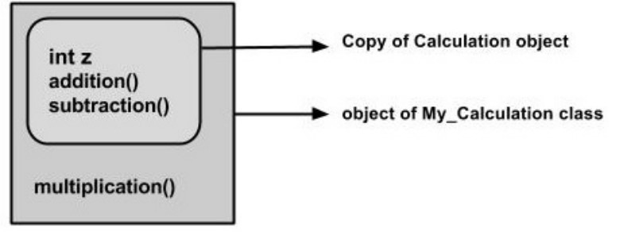

# Unit II

> Classes & Objects: Class fundamentals, declaring object reference variable, Introducing methods, constructors, the key word, garbage collection, Overloading methods. Inheritance and polymorphism: super class and subclass, protected members, Relationship between super and sub class. Inheritance hierarchy, abstract classes and methods, final methods and classes, nested classes, Type wrappers.


# Constructors

- The general rule is that when a subclass is created Java will call the superclass constructor first and then call the subclass constructors in the order determined by the inheritance hierarchy
- If a superclass does not have a default constructor with no arguments, the subclass must explicitly call the superclass constructor with the appropriate arguments 

# Inheritance

## Introduction

Inheritance can be defined as the process where one class acquires the properties methods and fields of another. With the use of inheritance, the information is made manageable in a hierarchical order.

- Inheritance is the process of taking the features(data members + methods) from one class to another class.
- The class which giving the features is known asbase/parent class/super class.
- The class which is taking the features is known as derived/child/sub class.
- Instance is known as sub classing or derivation or extend-able classes or re usability.

## Advantages of Inheritance

- Application development time is very less.
- Re usability: Redundancy (repetition) of the code is reducing. Hence we can get less memory cost and consistent results.
- Instrument cost towards the project is reduced.
- We can achieve the slogan write one’s reuse/run any where (WORA) of JAVA.
- Achieve oops inheritance concepts.
- inheritance is transitive.
- In Java, all methods except of constructors override the methods of their ancestor class by replacement.
- If a method is declared with the final modifier, it cannot be overridden.

## Types of Inheritance

Reusable techniques

Based on taking the features from base class to the derived class, in JAVA we have five types of inheritances. They are as follows: 

1. Single Inheritance
2. Multilevel Inheritance
3. Hierarchical Inheritance
4. Multiple Inheritance
5. Hybrid Inheritance

### Single Inheritance

Single Inheritance is one in which there exists single base class and single derived class.

                              


### Multi-level inheritance

Multi-level inheritance is one which there exist single base class, single derived class and n number of intermediate base classes.  An intermediate base class is one, in one context it acts as bass class and in another context it acts as derived class.


### Why multiple inheritance is not supported in Java.

1. To remove ambiguity.
2. To provide more maintainable and clear design.


## Extends Keyword

Extends is the keyword used to inherit the properties of a class. Below given is the syntax of extends keyword.

```java
class Super
{
Statements;
}

class Sub extends Super
{
Statements;
}

e.g. 
class Calculation
{
int z;
public void addition(int x, int y)
{
z=x+y;
System.out.println("The sum of the given numbers:"+z);
}
public void Substraction(int x,int y)
{
z=x-y;
System.out.println("The difference between the given numbers:"+z);
}	
}

public class My_Calculation extends Calculation
{
  public void multiplication(int x, int y)
  {
    z=x*y;
    System.out.println("The product of the given numbers:"+z);
  }
  public static void main(String args[])
  {
	int a=20, b=10;
    My_Calculation demo = new My_Calculation();
    demo.addition(a, b);
    demo.Substraction(a, b);
    demo.multiplication(a, b);
	}
}
```



The Superclass reference variable can hold the subclass object, but using that variable you can access only the members of the superclass, so to access the members of both classes it is recommended to always create reference variable to the subclass.

If you consider the above program you can instantiate the class as given below as well. But using the superclass reference variable ( cal in this case ) you cannot call the method multiplication, which belongs to the subclass My_Calculation.
**Note:** A subclass inherits all the members fields, methods, and nested classes from its superclass. Constructors are not members, so they are not inherited by subclasses, but the constructor of the superclass can be invoked from the subclass.

The Superclass reference variable can hold the subclass object, but using that variable you can access only the members of the superclass, so to access the members of both classes it is recommended to always create reference variable to the subclass. 

If you consider the above program you can instantiate the class as given below as well. But using the superclass reference variable ( cal in this case ) you cannot call the method multiplication, which belongs to the subclass My_Calculation.

**Note**: A subclass inherits all the members fields, methods, and nested classes from its superclass. Constructors are not members, so they are not inherited by subclasses, but the constructor of the superclass can be invoked from the subclass.

## Super keyword

In Java, super keyword is used to refer to immediate parent class of a class. In other words super keyword is
used by a subclass whenever it need to refer to its immediate super class.
The super keyword is similar to this keyword following are the scenarios where the super keyword is used. It is used to differentiate the members of superclass from the members of subclass, if they have same names. It is used to invoke the superclass constructor from subclass.


## Differentiating the members

If a class is inheriting the properties of another class. And if the members of the superclass have the names same as the sub class, to differentiate these variables we use super keyword as shown below.

```java
super.variable
super.method();
e.g. 
class Super_class
{
	int num=20;
	//display method of superclass
  public void display()
  {
	  System.out.println("This is the display method of superclass");
  }
}

public class Sub_class extends Super_class
{
  int num=10;
  //display method of sub class
  public void display()
  {
  	System.out.println("This is the display method of subclass");
  }
  public void my_method()
  {
      //Instantiating subclass
      Sub_class sub=new Sub_class();
      //Invoking the display() method of sub class
      sub.display();
      //Invoking the display() method of superclass
      super.display();
      //printing the value of variable num of subclass
      System.out.println("value of the variable named num in sub class:"+ sub.num);
    //printing the value of variable num of superclass
    System.out.println("value of the variable named num in super class:"+ super.num);
  }

  public static void main(String args[])
  {
    Sub_class obj = new Sub_class();
    obj.my_method();
  }
}```
```

## Invoking Superclass constructor

If a class is inheriting the properties of another class, the subclass automatically acquires the default constructor of the super class. But if you want to call a parametrized constructor of the super class, you need to use the super keyword as shown below.

```java
super(values);
e.g. 
class Superclass
{
int age;
Superclass(int age)
{
this.age=age;
}
public void getAge()
{
System.out.println("The value of the variable named age in super class is: " +age);
}
}
public class Subclass extends Superclass 
{
Subclass(int age)
{
super(age);
}
public static void main(String argd[])
{
Subclass s= new Subclass(24);
s.getAge();
}
}
```

## IS-A Relationship

IS-A is a way of saying : This object is a type of that object. Let us see how the extends keyword is used to achieve inheritance.

```java
public class Animal{}
public class Mammal extends Animal{}
public class Reptile extends Animal{}
public class Dog extends Mammal{}
```

With use of the extends keyword the subclasses will be able to inherit all the properties of the superclass except for the private properties of the superclass.

## Instanceof Keyword

Let us use the instanceof operator to check determine whether Mammal is actually an Animal, and dog is actually an Animal

## Can you use both this() and super() in a Constructor?

NO, because both super() and this() must be first statement inside a constructor. Hence we cannot use them together.

## Difference between Overloading and Overriding

| **Properties** | **Overloading**                                              | **Overriding**                                               |
| -------------- | ------------------------------------------------------------ | ------------------------------------------------------------ |
|                | Overloading  deals with multiple methods in the same class with the same name but different  signatures | Overriding  deals with two methods, one in a parent class and one in a child class, that  have the same signature |
|                | Overloading  lets you define  a  similar operation in different ways for  different data | Overriding  lets you define  a  similar operation in different ways  for   different object types |

## Controlling inheritance

- Visibility modifiers  determine  which class members are accessible and which do not
- Members (variables and methods) declared with publicvisibility are accessible, and those with private visibility are not

**Problem: How to make class/instance variables visible only to its subclasses?**
**Solution:** Java provides a third visibility modifier that helps in inheritance situations: protected


# Polymorphism

Polymorphism is the ability of an object to take on many forms. The most common use of polymorphism in OOP occurs when a parent class reference is used to refer to a child class object. Any Java object that can pass more than one IS-A test is considered to be polymorphic. 
In Java, all Java objects are polymorphic since any object will pass the IS-A test for their own type and for the class Object.
It is important to know that the only possible way to access an object is through a reference variable. A reference variable can be of only one type. Once declared, the type of a reference variable cannot be changed. The reference variable can be reassigned to other objects provided that it is not declared final. The type of the reference variable would determine the methods that it can invoke on the object. A reference variable can refer to any object of its declared type or any subtype of its declared type. A reference variable can be declared as a class or interface type.

# Wrapper Classes

Vectors cannot handle primitive datatypes like int, float,long, char, and double. Primitive data types may be converted into object typesusing the wrapper classes contained in the java.lang.package.

The following table gives the details about those classes andmethods used for converting storing data to fundamental data: 

| **DATA TYPES** | **WRAPPER CLASS** | **CONVERTION METHOD FROM STRING DATA TO  FUNDAMENTAL DATA TYPE** | **Converting Object Numbers to Primitive  Number Using typeValue() method** |
| -------------- | ----------------- | ------------------------------------------------------------ | ------------------------------------------------------------ |
| byte           | Byte              | public static byte parseByte (string)                        |                                                              |
| short          | Short             | public static short parseShort (string)                      |                                                              |
| int            | Integer           | public static int parseInt (string)                          | int i = IntVal.intValue();                                   |
| long           | Long              | public static long parseLong (string)                        | Long  i = LongVal.longValue();                               |
| float          | Float             | public static float parseFloat (string)                      | float i = FloatVal.floatValue();                             |
| double         | Double            | public static double parseDouble (string)                    | double i = DoubleVal.doubletValue();                         |
| char           | Char              | public static char parseChar (string)                        |                                                              |
| boolean        | Boolean           | public static boolean parseBoolean(string)                   |                                                              |

 

Wrapper classes are basically used for converting the string data into fundamental data type. Each and every wrapper class contains the following generalized parse methods.
public static Xxx parseXxx (String);
here, Xxx represents fundamental data type. 

The wrapper classes have a number of unique methods for handling primitive data types and objects

Whenever we develop a JAVA program it is recommended to write ‘n’ number of business logic classes and single execution logic class. A business logic class is one which contains ‘n’ number of user defined methods in which we write business logic. Business logic is one which is provided by JAVA programmer according business rules (requirements) started by customer. Whatever data we represent in JAVA runtime environment it is by default treated as objects of string data. As a programmer when we start any JAVA program an object of string class is created depends on number of values we pass.

 