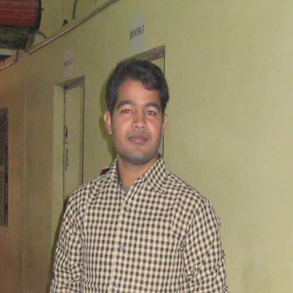

Hint: विद्या ददाति विनयं विनयाद्याति पात्रताम्

**Introduction**

My philosohpy about learning is “Learning is never ending process”.

**About Me**

Seeking a position in Education Industry that utilizes my skills and abilities for achieving its goals and offers me high-level professional and technical growth through continuous learning process.

<figure>
        
</figure>
**Work Experience**
Industrial Experience : 1
Teaching Experience: 6.5
Research: 3

1. `TEACHING` : **3 Yrs**. Presently working as, a Sr. Lecturer at Shree Shyam College, w.e.f. Jul. 2015. (Affiliated by UOK KOTA)
2. `TEACHING` :**4 Yrs. 5 Month** of Experience (May 31, 2015) as Senior Lecturer at APEX COLLEGE, w.e.f. DEC. 2010. (Affiliated by UOK KOTA)
3. `INDUSTRY`  :Worked as a Software Developer for 11 months in Padam Soft Solutions Gurgaon
4. `RESEARCH` : 3

**Membership**

- Associate, Life membership** of “Computer Society of India”.
- **SDIWC**- Society of Digital Information and wireless communication.
- ACM CSTA
- **Data Science Foundation** ID: **I01003**
- **THEIRED**/**UACEE**, Sr. Member, Membership Id: **SNM10100058539**
- Individual Membership from Oracle Academy till  9/5/2020.

**Qualification**

1. Ph.D. (Submitted)
2. M.C.A.(Hon’s)
3. SET/SLET
4. B.Sc.(PCM)

**Paper Presented**
International : 8
National : 5

**Workshop**

1. International : 4

**Research**
My Research based on  audit able security of large scale data at the integration or real time and provide analysis to the security automation system.

Considering existed algorithms for processing, large scale integration, distributed computing, cloud computing, RSA, Automation…

